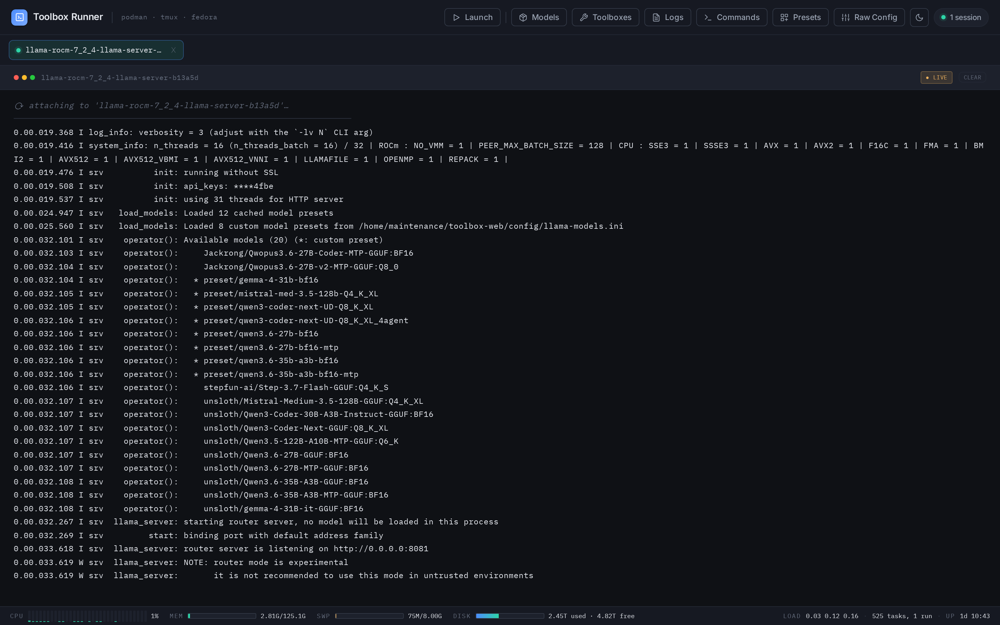
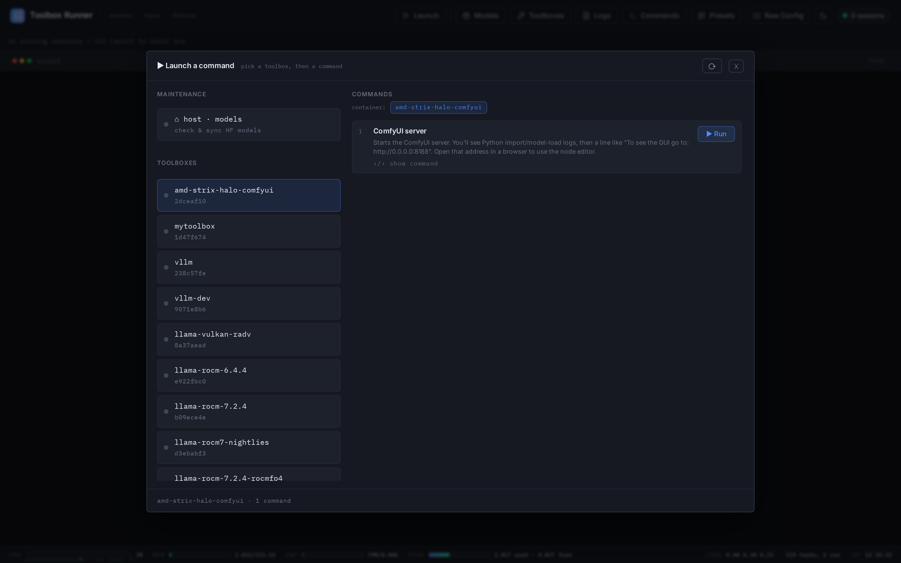
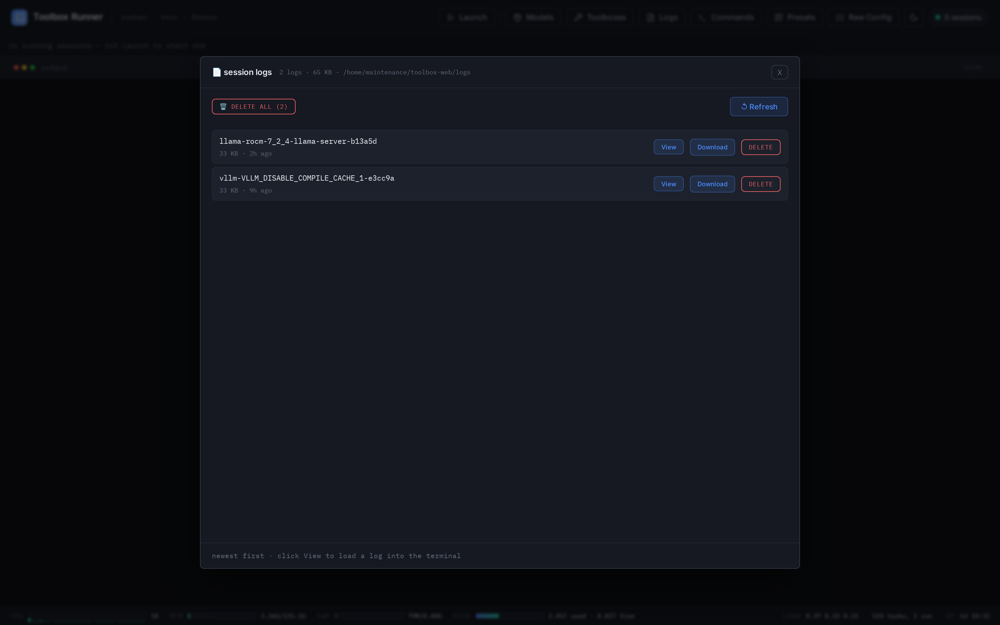
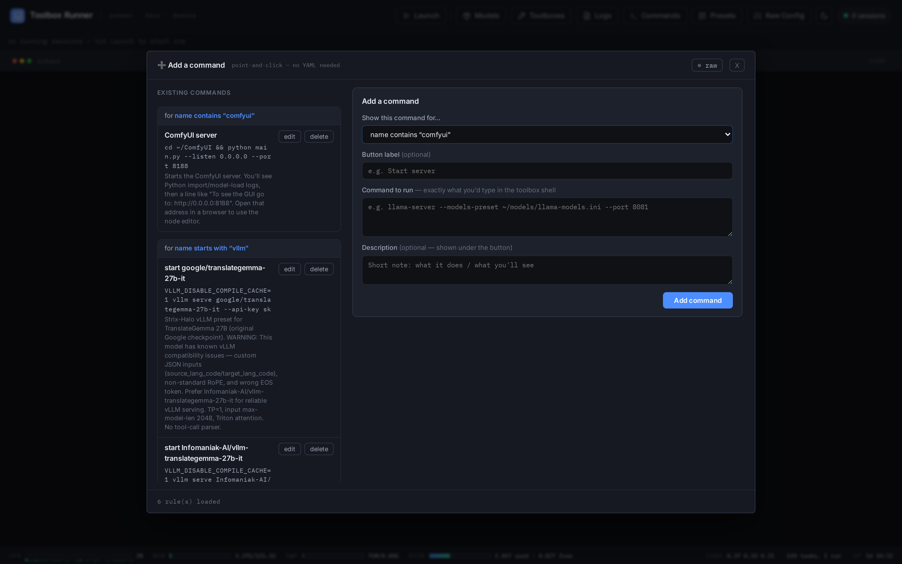
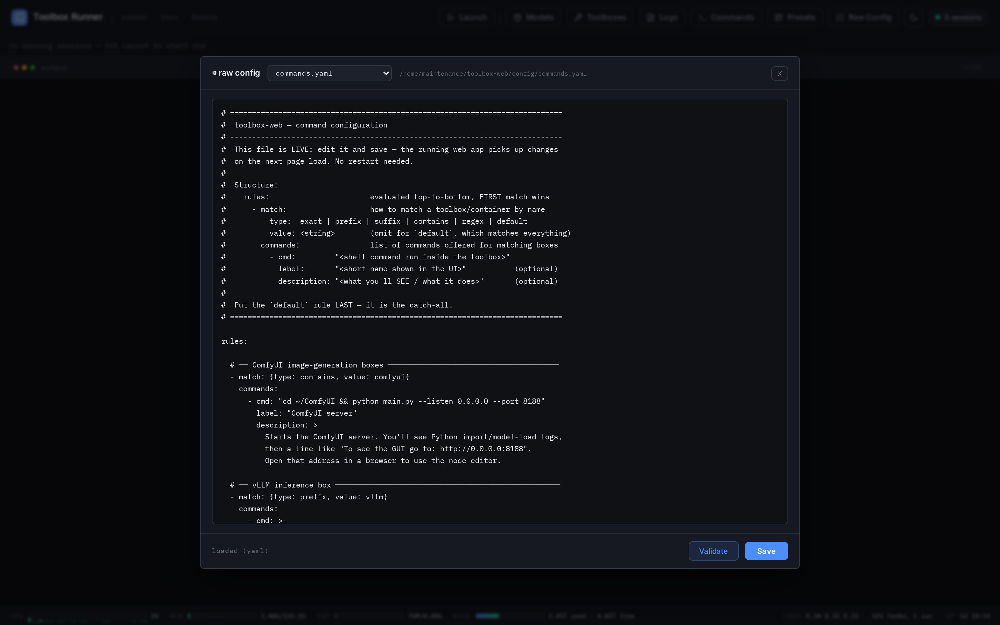
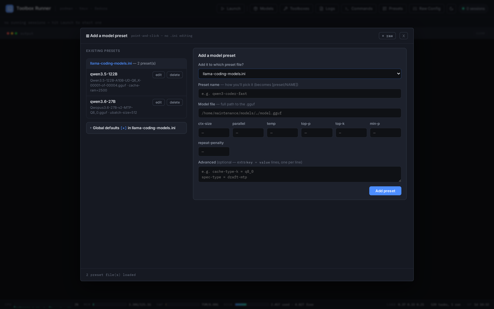
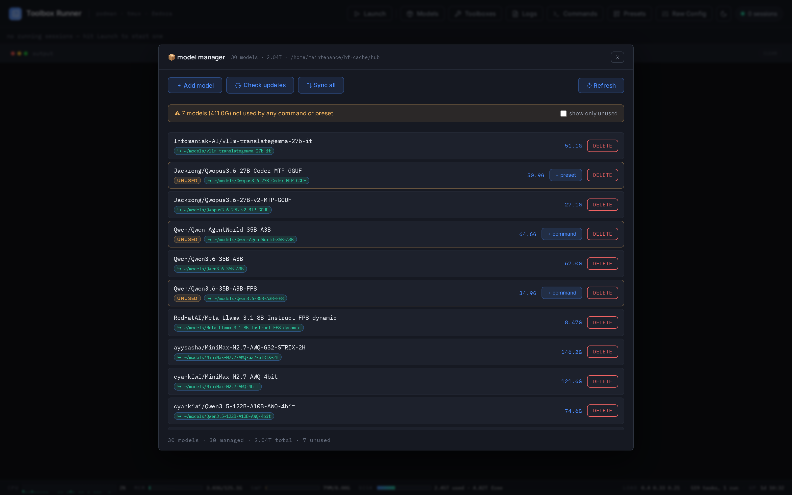
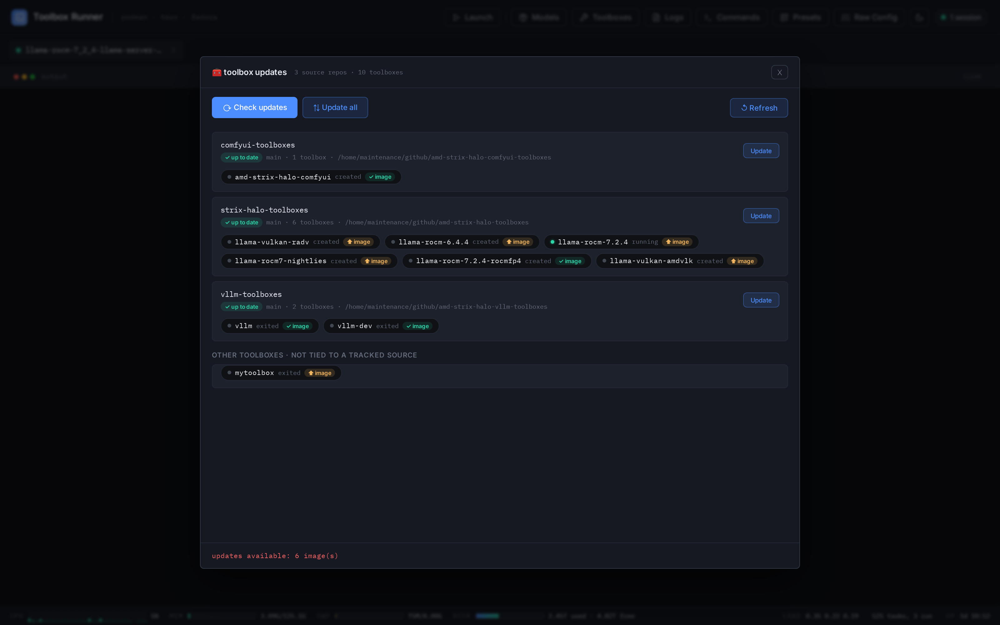

# Toolbox Runner

Web interface for running commands inside Podman toolboxes on Fedora.
**tmux backend** — sessions survive browser close/reload/reboot.

> The repo, systemd service, and Python package are all named **`toolbox-web`** —
> that's the name you'll see in paths and `systemctl` commands throughout this guide.

## What this is

A web interface over **[kyuz0's AMD Strix Halo toolboxes](https://github.com/kyuz0/amd-strix-halo-toolboxes)** —
the Podman toolbox images that ship llama.cpp, vLLM, and ComfyUI builds tuned for
AMD Strix Halo. kyuz0's project drives those toolboxes from a **TUI**; this app puts
a browser UI on the same containers and adds live log streaming plus model, preset,
and toolbox management.

**You build the toolbox images first** — this app runs commands *inside* them, it
doesn't create them. Each of kyuz0's repos has its own build instructions:

- [amd-strix-halo-toolboxes](https://github.com/kyuz0/amd-strix-halo-toolboxes) — llama.cpp (ROCm / Vulkan)
- [amd-strix-halo-comfyui-toolboxes](https://github.com/kyuz0/amd-strix-halo-comfyui-toolboxes) — ComfyUI
- [amd-strix-halo-vllm-toolboxes](https://github.com/kyuz0/amd-strix-halo-vllm-toolboxes) — vLLM

Until at least one toolbox is built, the **Launch** modal's toolbox list will be
empty. (Any Podman toolbox works, but the bundled `commands.yaml` is written around
these.)

## Requirements

```bash
sudo dnf install tmux toolbox   # toolbox/podman runs the commands; tmux keeps sessions alive
# uv manages Python (3.14) and all dependencies:
curl -LsSf https://astral.sh/uv/install.sh | sh
```

Plus **at least one toolbox image built** from kyuz0's repos (see [What this is](#what-this-is)).

## Config files

The live config under `config/` is git-ignored — it holds machine-specific paths,
your personal model list, and API keys. The repo ships **sanitized `*.example`
files** instead. On a fresh clone, copy each one to its real name and edit to taste:

```bash
cd ~/toolbox-web
for f in config/*.example; do cp -n "$f" "${f%.example}"; done   # copy without clobbering
$EDITOR config/llama-keys.txt      # put your real llama-server / vLLM API key here
$EDITOR config/llama-models.ini    # fix the model paths (the examples use /home/youruser/…)
```

What each file is for:

- **`commands.yaml`** — the commands offered per toolbox (see [Customizing commands](#customizing-commands))
- **`llama-models.ini`**, **`llama-coding-models.ini`** — llama.cpp preset defaults
- **`models.yaml`** — the curated model list `sync-models` downloads
- **`llama-keys.txt`** — the API key file for `llama-server --api-key-file` (keep it secret; never commit it)

> **Skipping this?** The app still starts without these files — the main page loads
> and every toolbox falls back to a plain interactive shell — but you'll get no
> preset commands or model list, and the in-browser config editor will report the
> missing files as *not found* until you copy them.

## Just run it

To start the app in the foreground without installing anything (handy for a
quick try or for development):

```bash
cd ~/toolbox-web
uv run flask --app app run    # or: uv run python app.py
```

It reads `.env`, binds `0.0.0.0:5000` by default, and stops with `Ctrl+C` — no
systemd, no autostart. For a persistent install that survives reboot, use the
one-command setup below instead.

## One-command install & autostart

```bash
cd ~/toolbox-web
bash scripts/install.sh
```

This will:
1. Sync the Python environment via `uv` (pinned to Python 3.14 — see `pyproject.toml`/`uv.lock`)
2. Seed a local `.env` from `.env.example` (if you don't have one yet)
3. Register `toolbox-web.service` as a systemd **user** service (runs via `uv run flask`)
4. Enable linger so the service starts at boot even before you log in
5. Open port 5000 hint for firewall

Then open **http://your-ip:5000** from any browser.

> **No uv?** `requirements.txt` is a pip fallback (auto-generated from `uv.lock`
> via `uv export`). It's not used by the install above — uv is the supported path —
> but `pip install -r requirements.txt` works if you'd rather not use uv.

## Configuration (`.env`)

All settings have sensible defaults — copy **`.env.example`** to **`.env`** and edit
only what you need. It's loaded automatically at startup (and is git-ignored, so it
can hold secrets). Common knobs:

- `FLASK_RUN_HOST` / `FLASK_RUN_PORT` — bind address & port (default `0.0.0.0:5000`;
  use `127.0.0.1` to restrict to localhost)
- `TOOLBOX_WEB_TOKEN` — require a token for config-write endpoints
- `TOOLBOX_WEB_MODELS_DIR`, `TOOLBOX_WEB_CONFIG`, `TOOLBOX_WEB_PRESETS_DIR`, … — path overrides
- `HF_TOKEN`, `HF_HOME` — standard Hugging Face vars

See [`.env.example`](.env.example) for the full annotated list.

## Protecting write actions (optional)

The app has no login and binds `0.0.0.0`, so anyone who can reach port 5000 can
run commands. To require a secret before anything that **changes state** — rewriting
the command file, downloading/updating/deleting models, or updating toolboxes — set
a token in `.env`:

```ini
TOOLBOX_WEB_TOKEN=your-secret-here
```

(Or add `Environment=TOOLBOX_WEB_TOKEN=…` under `[Service]` in `toolbox-web.service`.)

When set, the relevant modals show a **write token** field, and any write without the
matching token is rejected with HTTP 403. Read-only actions (the update checks) stay
open.

## Moving to another machine

See **[MIGRATION.md](MIGRATION.md)** for the full new-machine setup guide
(prerequisites, what's bundled vs. regenerated, and step-by-step transfer).

---

## The interface



The whole window is one **output canvas** — there's no sidebar. You start work from
the **Launch** button (top-left) and watch it stream in the terminal below.

- **Session tabs** — a tab bar across the top, one tab per **live tmux session**.
  Click a tab to bring that session's output into the terminal; the active tab is
  highlighted. With nothing running it reads *"no running sessions — hit Launch to
  start one."*
- **Output terminal** — streams the selected session's output live, and every
  session keeps running after you close the browser.
- **Status bar** — host CPU (per-core), memory, swap, disk, load, task count, and
  uptime at a glance, along the bottom.

The header buttons — **Launch**, **Models**, **Toolboxes**, **Logs**, **Commands**,
**Presets**, **Raw Config**, plus the light/dark toggle and a live **session count**
badge — each open a modal covered in its own section below.

### Launch modal

Click **Launch** to pick what to run — everything that starts a session goes through
here.



- **Pick a target (left)** — the **Maintenance** entry (`⌂ host · models`) runs
  host-side model check/sync, and below it every **toolbox** is listed (each with a
  status dot — green when its container is running). Click one to select it.
- **Pick a command (right)** — the selected target's commands appear, each with its
  **label** and **description**. The **‹/› show command** toggle reveals the raw
  command (with any `--api-key` value masked), and **▶ Run** launches it (it shows
  **↺** when that command is already running).
- **Reconnect / Kill** — when the selected toolbox already has a live session, the
  context line flags it and the action row offers **⟳ Reconnect** (pull its output
  back into the terminal) and **■ Kill**.

Launching closes the modal, adds a tab for the new session, and starts streaming into
the terminal.

---

## How it works

```
Browser ──SSE──► Flask app ──tmux──► toolbox run --container <name> bash -c "<cmd>"
                                         └─ tmux session persists forever
```

- Each command gets a deterministic tmux session name (e.g. `llama-rocm-llama-server`)
- Close the browser tab → session keeps running
- Reopen the page → click the session's tab (or **Launch → Reconnect**) to see output

**Container lifecycle is reference-counted:** several commands can share one toolbox
container. A container is only stopped (`podman stop`) once its *last* session ends,
so running a short command in a toolbox won't tear down a long-running server in the
same toolbox. (Teardown of a naturally-exited container happens within ~15 s, via the
background session watcher.)

### Live output / logs

Each session's raw output is teed to a log file (`tmux pipe-pane`) and streamed
to the browser over SSE:

- Long-running servers (llama-server, vLLM, ComfyUI) stream for their whole
  lifetime — no output cap.
- In-progress lines (download/load progress bars using `\r`) update live.
- Reconnects resume exactly where they left off, so a dropped connection never
  re-dumps or duplicates output.
- The tab stays smooth even under a burst of thousands of lines/sec (e.g.
  `podman pull` printing "Copying blob …").
- Logs live in `logs/` (override with `TOOLBOX_WEB_LOG_DIR`), are reset when a
  command is re-run, and are pruned after 3 days. You can still view a session's
  full output even after it has exited.

### Browsing past logs

Click **Logs** in the header to browse every log on disk (newest first), even
for sessions that have ended.



Each row shows the session id, size, and age, and flags any still **live**.
**View** loads the full log into the main terminal (a live session keeps
streaming), **Download** saves it ANSI-stripped, and **Delete** removes the file
(refused while live; gated by `TOOLBOX_WEB_TOKEN` when set). Logs also auto-prune
after 3 days. The log id is exactly the tmux session name, so `GET /api/stream/<id>`
serves a finished session's whole log — which is what **View** uses.

---

## Firewall

Only needed if you reach the app from another machine and firewalld is blocking
port 5000 — local/localhost access works without it:

```bash
sudo firewall-cmd --add-port=5000/tcp --permanent
sudo firewall-cmd --reload
```

## Service management

```bash
systemctl --user status  toolbox-web   # check
systemctl --user restart toolbox-web   # restart (e.g. after a code update)
systemctl --user stop    toolbox-web   # stop
journalctl --user -u toolbox-web -f    # live logs
```

## Customizing commands

Commands live in **`config/commands.yaml`** — not hardcoded in the app. The file is
**hot-reloaded**: save your edit and the change appears on the next page load,
**no restart needed**.

```yaml
rules:                       # checked top-to-bottom, first match wins
  - match:
      type:  exact | prefix | suffix | contains | regex | default
      value: vllm            # (omit for `default`, which matches everything)
    commands:
      - cmd:         "vllm serve ... --port 8000"
        label:       "vLLM serve"          # short name shown in the UI
        description: "What you'll see when this runs."
```

- `match.type` sets how the rule matches. Put the `default` rule **last**.
- Each `cmd` carries a **label** and **description** shown in the UI; it may also be
  a bare string (no label/description) for quick entries.
- Point at a different file with the `TOOLBOX_WEB_CONFIG` env var.

If `commands.yaml` has a syntax error, the app logs it (`journalctl --user -u toolbox-web`)
and keeps serving the last good version.

### Adding commands without YAML (form builder)

Click **Commands** in the header for a point-and-click form — the friendly path for
non-technical users.



Pick **which toolboxes** the command applies to (existing rule or "a new toolbox
match…"), type a **label**, the **command** exactly as you'd run it in the shell
(multi-line is fine — no YAML quoting to get right), and an optional description.
**Add command.** Existing commands are listed on the left with **edit**/**delete**.

Behind the scenes this rewrites `commands.yaml` with a round-trip YAML parser, so
**all comments and formatting are preserved**, the result is validated before
writing, and a `commands.yaml.bak` is kept — the form can never produce a broken
file. Changes are live immediately. New toolbox matches are inserted just *before*
the `default` catch-all so first-match order is preserved.

### Editing the raw file in the browser

Click **Raw Config** in the header for direct text editing of `commands.yaml` (and
the llama.cpp model `.ini` preset files — pick the file from the dropdown).



**Validate** checks it server-side and **Save** (or `Ctrl/Cmd+S`) writes it back
atomically — the previous version is kept as `commands.yaml.bak`. Invalid YAML is
rejected and the file on disk is never touched. Saving takes effect immediately
(hot reload). For a no-edit way to manage presets, use the **Presets** form (below).

### Adding model presets without editing .ini (preset builder)

Click **Presets** in the header for a point-and-click form over the llama.cpp
preset `.ini` files.



Choose **which `.ini` file** to add to (selecting one hot-reloads its existing
presets into the form), give the preset a **name** (becomes `[preset/NAME]`), pick
the **model .gguf**, and fill in the common knobs as labelled fields — anything
else goes in **Advanced** as plain `key = value` lines. **Add preset.** Existing
presets are listed on the left with **edit**/**delete**.

The **Global defaults `[*]`** card edits the shared `[*]` section of the selected
file (the values inherited by every preset) — one `key = value` per line, with
comments kept. **Save defaults** writes just that section, leaving every preset's
comments and settings untouched.

The `.ini` files are edited by **section splicing**: each `[section]` keeps its own
comments and header verbatim, so adding a preset (or editing/deleting one) never
disturbs the comments of the others. The result is validated before writing and a
`.bak` is kept. A brand-new file is seeded with a minimal `[*]` defaults section.
Presets take effect the next time you start `llama-server`.

> The `toolbox-web-watch.path` unit only watches **app.py** and **templates/index.html**
> for restarts — `commands.yaml` is deliberately excluded so editing commands never
> bounces the service.

---

## Model manager

Click **Models** in the header. The modal lists every Hugging Face model in the
local cache (repo, on-disk size, and which `~/models` symlinks point at it), and
adds browse / download / update on top of delete.



Long-running actions (download, update, sync, delete) start a host session and
**stream into the main terminal**, just like running a command — so you can close
the modal and watch progress, and the session survives a browser reload.

The curated list lives in **`config/models.yaml`** (a `{name, repo, pattern}` list);
the web app reads it for the managed entries and appends to it when you add a model.
`scripts/sync_models.py` downloads/links the whole list (run via the project venv).

### Unused-model check

The manager flags **downloaded models that aren't wired to any launch** — i.e. not
referenced by a command in `commands.yaml` **or** a `model = …` line in any preset
`.ini`. An amber banner shows the count and total size (e.g. *"⚠ 7 models (462 G)
not used by any command or preset"*), each such row gets an **unused** badge, and a
**show only unused** filter narrows the list. Matching is by repo id (as a whole
token, so `…-A3B` ≠ `…-A3B-FP8`) and by GGUF filename, with split shards
(`-00001-of-000NN`) treated as one model so the extra shards aren't false-flagged.
Loose `.gguf` files under `~/models` that no preset/command uses are listed in their
own section. Each flagged model offers a one-click wire-up that opens the right
form pre-filled: **+ preset** (GGUF models → llama.cpp `.ini`, with the `.gguf` path
filled in) or **+ command** (safetensors repos → a vLLM serve starter). Helper files
(draft / mmproj) are hard to attribute, so treat the list as *likely unused* to
review — nothing is deleted automatically.

### What the buttons do

- **＋ Add model** — opens a form (repo · name · file pattern). On *Download &
  remember*, the app appends an `hf-link` line to `sync-models` (after the last
  entry, deduplicated) and then runs it. `name` defaults to the repo's basename;
  `pattern` defaults to `*` (all files). Blank patterns pull the whole repo.
- **⟳ Check updates** — compares each cached repo's local `refs/main` against the
  Hub API (concurrently), then tags each row **✓ up to date**, **↑ update
  available**, or **? unknown**. Rows with an update reveal an **Update** button.
- **Update** (per row) — re-runs that model's `hf-link` entry to pull the latest
  revision and re-point its `~/models` symlink.
- **⇅ Sync all** — runs the whole `sync-models` script (download/update every
  managed model + refresh symlinks, then `hf cache prune`).
- **Delete** (per row) — runs `scripts/drop_model.py`: removes the `~/models` symlink
  and the cache via `hf cache rm`.

Models in the cache that aren't in `sync-models` are tagged **unmanaged**.

### Notes

- **Update detection is commit-level.** A repo is flagged "update available" when
  its `main` branch moved — even if the specific files your pattern uses didn't
  change. Running the update is still cheap: `hf-link` only pulls your pattern's
  files.
- **Updating an *unmanaged* model** uses `name = repo basename` and `pattern = *`,
  which creates a `~/models` symlink that didn't exist before.
- **Auth.** Update checks and downloads resolve your HF token the way the CLI does
  (`HF_TOKEN`, else `~/.cache/huggingface/token`). Without one, gated/private
  repos report **? unknown**.
- **Token gate.** When `TOOLBOX_WEB_TOKEN` is set (see above), the modal shows a
  "write token" field; download / update / sync / delete without the matching
  token are rejected with HTTP 403. The read-only update check is not gated.

---

## Toolbox updates

Click **Toolboxes** in the header. The modal lists your toolbox **source repos**
(the git checkouts that build the toolbox images) and lets you check each against
its GitHub upstream **and** each built container against its registry image, then
rebuild — the toolbox analog of the model manager. Updates stream into the main
terminal like everything else.



The update unit is the **repo**, not the individual toolbox container the Launch
modal lists: each repo's refresh script rebuilds/pulls its images.

### Grouped view

Each repo is a card showing its update status and the **toolbox containers it
builds**, grouped beneath it (with a status dot — green when running). Containers
are matched to their repo by the image's `org.opencontainers.image.source` label,
falling back to the image name. After a check, each container chip also carries an
**image badge** — **✓ image** when its local image digest matches the registry, or
**⬆ image** when a newer image is available (hover for the local vs. remote
digests). Toolboxes that don't belong to a tracked repo (e.g. the base
`fedora-toolbox`) appear in an **Other toolboxes** group with no Update button —
they aren't built from one of the configured sources, but they're still image-checked.
The header summarises totals, e.g. *"3 source repos · 11 toolboxes"*.

### What the buttons do

- **⟳ Check updates** — two checks in one pass (concurrently). It runs `git fetch`
  on each repo and tags it **✓ up to date** or **↑ N behind** (commits behind
  upstream; **? no upstream** with no tracking branch, **✕ repo missing** for a gone
  checkout), **and** compares every built container's local image digest against the
  registry, badging each chip **✓ image** or **⬆ image**. The footer summarises both,
  e.g. *"updates available: 1 repo(s), 6 image(s)"* — or *"repos & images up to date"*.
- **Update** (per row) — `cd` into the repo, `git pull`, then run its configured
  refresh command (rebuilds/pulls that repo's toolbox images).
- **⇅ Update all** — does the same for every repo in order.

### Configuring the repos

The repo list lives under a `toolbox_repos:` key in **`commands.yaml`** (editable in
the browser, hot-reloaded). If the key is absent, a built-in default is used. Each entry is `name` / `path` / `update`, where
`update` is the shell run **inside** the repo after `cd`:

```yaml
toolbox_repos:
  - name:   comfyui-toolboxes
    path:   /home/maintenance/github/amd-strix-halo-comfyui-toolboxes
    update: git pull && ./refresh-toolbox.sh latest
  - name:   strix-halo-toolboxes
    path:   /home/maintenance/github/amd-strix-halo-toolboxes
    update: git pull && ./refresh-toolboxes.sh all
  - name:   vllm-toolboxes
    path:   /home/maintenance/github/amd-strix-halo-vllm-toolboxes
    update: >
      git pull && ./refresh_toolbox.sh latest &&
      sed 's/^TOOLBOX_NAME=.*/TOOLBOX_NAME="vllm-dev"/' refresh_toolbox.sh | bash -s -- dev
```

### Notes

- **Two independent signals.** The **repo** badge is commit-level — "↑ behind" means
  the tracked branch moved on GitHub. The **image** badge is digest-level — "⬆ image"
  means the registry has a newer image than the one you built. They can disagree:
  a repo can read "up to date" while a `:latest` image shows "⬆ image" (a re-tagged
  upstream image), which the old commit-only check missed. Either way, running the
  repo's **Update** rebuilds/pulls the current images.
- **Token gate.** With `TOOLBOX_WEB_TOKEN` set, Update / Update all require the
  "write token" (HTTP 403 otherwise). The read-only check is not gated.
